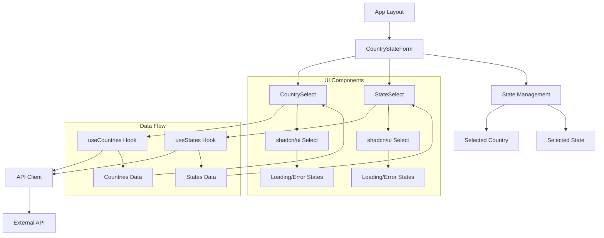

# Country-State Dropdown Application


[](https://www.typescriptlang.org/)
[](https://nextjs.org/)
[](https://tailwindcss.com/)
[](./coverage)

## ✨ Features

- **Cascading Dropdowns**: Intelligent country-state selection with automatic state list updates
- **Real-time API Integration**: Live data fetching from external country/state API
- **Error Handling**: Robust error boundaries with user-friendly fallbacks
- **Loading States**: Smooth loading indicators and skeleton components
- **Search Functionality**: Searchable dropdowns for improved UX
- **TypeScript**: Full type safety across the entire application
- **Comprehensive Testing**: >80% test coverage with unit and integration tests

## 🏗️ Architecture Overview



## 🚀 Technology Stack

### Core Framework
- **[Next.js 15](https://nextjs.org/)** - React framework with App Router for optimal performance
- **[React 19](https://reactjs.org/)** - Modern React with latest features and hooks
- **[TypeScript](https://www.typescriptlang.org/)** - Static type checking for enhanced development experience

### Styling & UI
- **[Tailwind](https://tailwindcss.com/)** - Utility-first CSS framework for rapid UI development
- **[shadcn/ui](https://ui.shadcn.com/)** - High-quality, accessible UI components

### Testing & Quality
- **[Vitest](https://vitest.dev/)** - Fast, modern testing framework
- **[React Testing Library](https://testing-library.com/)** - Simple and complete testing utilities

## 📋 Prerequisites

Before you begin, ensure you have the following installed:
- **Node.js** (version 18.17 or higher)
- **npm** (version 9 or higher) or **yarn** (version 1.22 or higher)
- **Git** for version control

## ⚡ Quick Start

### 1. Clone the Repository
```bash
git clone <repository-url>
cd sdg-exam
```

### 2. Install Dependencies
```bash
npm install
```

### 3. Environment Configuration
Create a `.env` file in the root directory:

```env
NEXT_PUBLIC_COUNTRY_API_BASE_URL=<API URL>
NEXT_PUBLIC_COUNTRY_API_KEY=<API KEY>
```

### 4. Run Development Server
```bash
npm run dev
```

Open [http://localhost:3000](http://localhost:3000) to view the application.

## 🧪 Testing

### Run All Tests
```bash
npm test
```

### Watch Mode (Development)
```bash
npm run test:watch
```

### Coverage Report
```bash
npm run test:coverage
```

View coverage report at `./coverage/index.html`

### Test Structure
- **Unit Tests**: Individual component and hook testing
- **Integration Tests**: Complete user flow testing

### Available Scripts
```bash
npm run dev          # Start development server
npm run build        # Build for production
npm run start        # Start production server
npm run lint         # Run ESLint
npm run test         # Run tests
npm run test:watch   # Run tests in watch mode
npm run test:coverage # Generate coverage report
```

## 🔌 API Integration

### Base Configuration
- **Base URL**: <API URL>
- **Authentication**: Custom header `X-API-Key`
- **Response Format**: JSON

### Endpoints

#### Get Countries
```typescript
GET /countries
Response: Country[]

interface Country {
  id: number;
  value: string;
}
```

#### Get States by Country
```typescript
GET /countries/{countryId}/states
Response: State[]

interface State {
  id: number;
  value: string;
}
```
